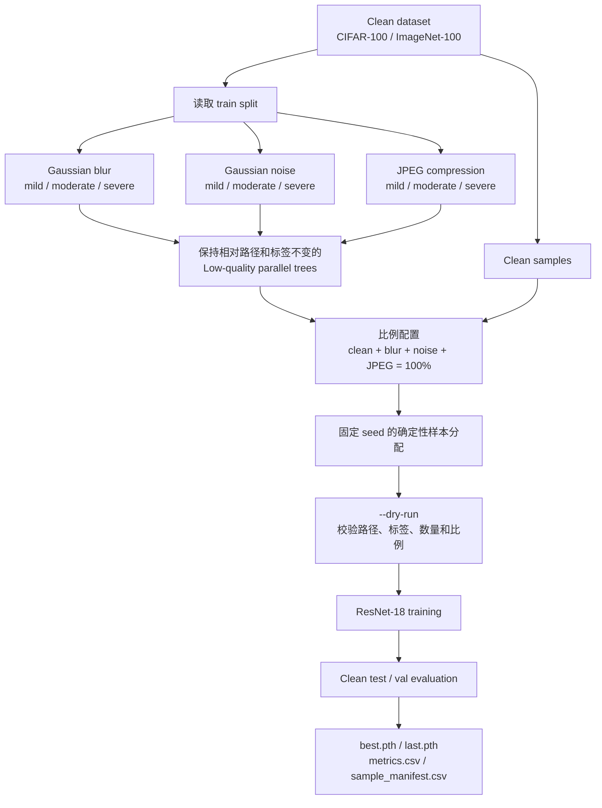

# Tolerence-Boundary

Code for *Where Does Learning Break? Mapping the Tolerance Boundary of Visual
Models*. The scripts generate Gaussian blur, Gaussian noise, and JPEG
compression data for CIFAR-100 and ImageNet-100, then train ResNet-18 with a
controllable mixture of clean and low-quality samples.

## 项目概览

本项目用于研究视觉模型面对低质量训练数据时的容忍边界。核心实验保持训练集
总规模和验证集不变，只按照给定比例将部分 clean 训练样本替换为路径、标签完全
对应的低质量版本，从而控制单一变量并比较模型性能变化。

当前实现包含：

- CIFAR-100 与 ImageNet-100 低质量训练数据生成；
- Gaussian blur、Gaussian noise、JPEG compression 三类退化；
- mild、moderate、severe 三级退化强度；
- clean 与三类退化数据的独立比例配置；
- 固定随机种子的确定性样本分配；
- ResNet-18 训练、clean test/val 评估、checkpoint 和实验清单保存。

## 工作流程



数据生成只处理 `train` split。测试集或验证集保持 clean，用于衡量低质量训练数据
对模型泛化能力的影响。

## 代码结构

| 文件 | 作用 |
| --- | --- |
| `gen_cifar_low_data.py` | CIFAR-100 低质量数据生成入口 |
| `gen_imagenet_low_data.py` | ImageNet-100 低质量数据生成入口 |
| `low_quality.py` | 三类退化、参数配置、路径保存和随机数逻辑 |
| `train_low_quality.py` | CIFAR-100 / ImageNet-100 统一比例混合训练入口 |
| `requirements.txt` | Python 依赖 |
| `gen_degrade_cifar.py` | 仓库原有 CIFAR 退化生成脚本 |
| `train_cifar_resnet18_*.py` | 仓库原有 CIFAR 训练脚本 |

## Installation

```bash
pip install -r requirements.txt
```

## Expected data layout

ImageNet-100 should use class subdirectories. CIFAR-100 may use the same layout,
or a flat image directory plus the existing two-column CSV label file.

```text
DATA_ROOT/
  train/
    class_000/*.jpg
    class_001/*.jpg
  test/                 # CIFAR-100 (or pass --val-split val)
  val/                  # ImageNet-100
```

Generated data keeps every relative path and is stored as:

```text
LOW_QUALITY_ROOT/
  gaussian_blur/{mild,moderate,severe}/train/...
  gaussian_noise/{mild,moderate,severe}/train/...
  jpeg_compression/{mild,moderate,severe}/train/...
```

### 退化强度

| 类型 | mild | moderate | severe |
| --- | --- | --- | --- |
| Gaussian blur | radius = 0.5 | radius = 1.0 | radius = 2.0 |
| Gaussian noise | sigma = 10 | sigma = 25 | sigma = 50 |
| JPEG compression | quality = 75 | quality = 40 | quality = 10 |

所有图像都以 RGB 模式处理。Gaussian noise 的随机数由 seed、相对路径、退化类型和
强度共同确定，因此中断后续跑或使用 `--overwrite` 重跑都能得到相同结果。

## Generate low-quality data

All three types and all three levels are generated by default. Existing files
are skipped, so an interrupted run can be resumed safely.

```bash
python gen_cifar_low_data.py \
  --input-root /data/cifar100/train \
  --output-root /data/cifar100/low_quality

python gen_imagenet_low_data.py \
  --input-root /data/imagenet100/train \
  --output-root /data/imagenet100/low_quality
```

To generate only selected variants:

```bash
python gen_cifar_low_data.py \
  --input-root /data/cifar100/train \
  --output-root /data/cifar100/low_quality \
  --types gaussian_blur jpeg_compression \
  --levels moderate severe \
  --seed 42
```

Use `--overwrite` to regenerate files. Gaussian noise is deterministic for a
given seed and relative image path.

## Train with configurable proportions

The four ratios must be non-negative and sum to 100. The assignment is fixed by
`--seed`; `sample_manifest.csv` records the exact source used for every sample.

```text
clean-ratio
+ gaussian-blur-ratio
+ gaussian-noise-ratio
+ jpeg-compression-ratio
= 100
```

比例换算后的样本数使用 largest-remainder 方法取整，因此最终分配数量始终等于
原始训练集大小。比例为 0 的退化类型不要求对应文件存在。

CIFAR-100 example with 70% clean and 10% of each degradation:

```bash
python train_low_quality.py \
  --dataset cifar100 \
  --data-root /data/cifar100 \
  --low-quality-root /data/cifar100/low_quality \
  --csv-path /data/cifar100/cifar100.csv \
  --clean-ratio 70 \
  --gaussian-blur-ratio 10 \
  --gaussian-noise-ratio 10 \
  --jpeg-compression-ratio 10 \
  --blur-level severe \
  --noise-level severe \
  --jpeg-level severe \
  --output-dir outputs/cifar100_70_10_10_10
```

Omit `--csv-path` when CIFAR-100 is arranged in class subdirectories.

ImageNet-100 example with 50% clean and 50% moderate JPEG compression:

```bash
python train_low_quality.py \
  --dataset imagenet100 \
  --data-root /data/imagenet100 \
  --low-quality-root /data/imagenet100/low_quality \
  --clean-ratio 50 \
  --gaussian-blur-ratio 0 \
  --gaussian-noise-ratio 0 \
  --jpeg-compression-ratio 50 \
  --jpeg-level moderate \
  --batch-size 256 \
  --output-dir outputs/imagenet100_jpeg50
```

Run with `--dry-run` first to validate paths, labels, degraded counterparts, and
the exact sample counts without starting training.

```bash
python train_low_quality.py \
  --dataset imagenet100 \
  --data-root /data/imagenet100 \
  --low-quality-root /data/imagenet100/low_quality \
  --clean-ratio 70 \
  --gaussian-blur-ratio 10 \
  --gaussian-noise-ratio 10 \
  --jpeg-compression-ratio 10 \
  --dry-run
```

## 训练产物

每个 `--output-dir` 中会保存：

| 产物 | 内容 |
| --- | --- |
| `config.json` | 完整命令行配置 |
| `data_summary.json` | 数据量、类别映射、请求比例与实际样本数 |
| `sample_manifest.csv` | 每个样本的 clean/退化来源、强度和实际路径 |
| `metrics.csv` | 每轮 learning rate、loss、accuracy 和耗时 |
| `best.pth` | clean test/val 准确率最佳的 checkpoint |
| `last.pth` | 最后一轮 checkpoint |

## 推荐实验步骤

1. 确认 clean 数据目录以及 CIFAR CSV 标签或类别子目录结构。
2. 使用对应的 `gen_*_low_data.py` 生成实验需要的退化类型和强度。
3. 使用 `train_low_quality.py --dry-run` 检查所有路径和精确样本比例。
4. 移除 `--dry-run` 开始训练，并为每组比例指定不同的 `--output-dir`。
5. 汇总各目录的 `metrics.csv`，比较低质量比例与 clean test/val 准确率。

为了保证不同实验之间可比较，建议固定 `--seed`、模型、优化器、epoch 和数据增强，
每次只修改退化类型、强度或数据比例中的一个因素。
